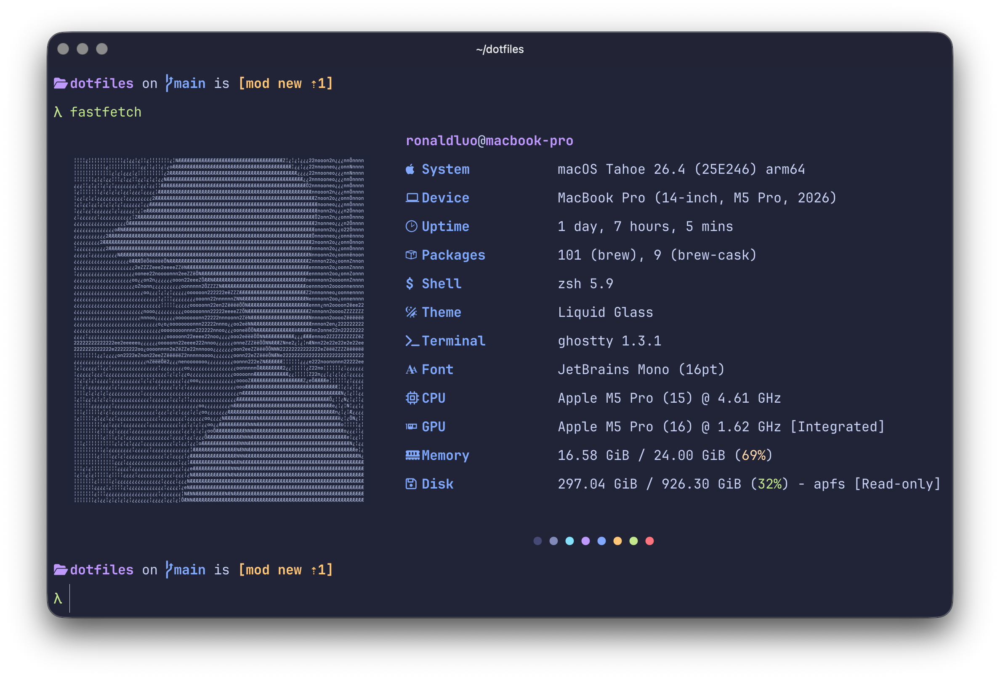

<p align="center">
  
</p>

# dotfiles

Personal configuration files for my development environment.

## Setup on a New Machine

```bash
git clone https://github.com/ronload/dotfiles.git ~/dotfiles
cd ~/dotfiles
./setup.sh
```

`setup.sh` will automatically install Homebrew, Rust, opencode, and Brewfile packages, then run `install.sh` to symlink configs, clone `fzf-git.sh`, and sync Neovim plugins. Each step is guarded so it can be safely re-run.

## Included Configs

- **nvim**: Neovim with lazy.nvim
- **ghostty**: Ghostty terminal
- **zsh**: Zsh shell (zshrc, zprofile, zshenv)
- **gh**: GitHub CLI
- **git**: Git global config
- **brew**: Brewfile for Homebrew packages

## Manual Setup

If you prefer not to run `install.sh`, the equivalent steps are:

```bash
# Base configs
mkdir -p ~/.config
ln -sfn ~/dotfiles/nvim                 ~/.config/nvim
ln -sfn ~/dotfiles/ghostty              ~/.config/ghostty
ln -sfn ~/dotfiles/gh                   ~/.config/gh
ln -sfn ~/dotfiles/git/gitconfig        ~/.gitconfig
ln -sfn ~/dotfiles/git/ignore           ~/.gitignore_global
ln -sfn ~/dotfiles/zsh/zshrc            ~/.zshrc
ln -sfn ~/dotfiles/zsh/zprofile         ~/.zprofile
ln -sfn ~/dotfiles/zsh/zshenv           ~/.zshenv

# Claude Code (CLAUDE.md, settings, statusline, plus every skill and hook)
mkdir -p ~/.claude/skills ~/.claude/hooks
ln -sfn ~/dotfiles/claude/CLAUDE.md     ~/.claude/CLAUDE.md
ln -sfn ~/dotfiles/claude/settings.json ~/.claude/settings.json
ln -sfn ~/dotfiles/claude/statusline.sh ~/.claude/statusline.sh
for d in ~/dotfiles/claude/skills/*/; do
  ln -sfn "$d" "$HOME/.claude/skills/$(basename "$d")"
done
for f in ~/dotfiles/claude/hooks/*.sh; do
  ln -sfn "$f" "$HOME/.claude/hooks/$(basename "$f")"
done

# fzf-git.sh (sourced by zshrc; no Homebrew formula available)
mkdir -p ~/.local/share
git clone --depth 1 https://github.com/junegunn/fzf-git.sh.git ~/.local/share/fzf-git.sh

# Neovim plugins (downloads tokyonight.nvim used by ghostty and delta)
nvim --headless "+Lazy! sync" +qa
```

## Linting

Bash scripts are checked with [shellcheck](https://www.shellcheck.net/). A GitHub Actions workflow runs on every push and pull request; locally:

```bash
./lint.sh
```

zsh files (`zshrc`, `*.zsh`, etc.) are not covered — shellcheck does not support zsh.

## Local Overrides

`git/gitconfig` conditionally includes a work identity for repos under `git@github.com:prinsur/**`:

```gitconfig
[includeIf "hasconfig:remote.*.url:git@github.com:prinsur/**"]
    path = ~/.gitconfig-prinsur
```

This override file is not tracked in the repo. Create it manually on each machine:

```bash
cat > ~/.gitconfig-prinsur <<'EOF'
[user]
    email = your-work-email@example.com
EOF
```

Without it, commits to `prinsur/*` repos fall back to the global identity.
